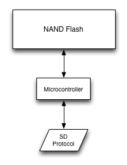

Most (if not all) SD cards consist of a chunk of cheap NAND flash tied to a
microcontroller of some sort, which handles bad block management and
translates the SD protocol into whatever protocol it is the NAND chips
speak.  The microcontroller also translates between the packet size of most
disk drives (512 or 1024 bytes) into that used by NAND flash (usually 128k
or 256k bytes).  In short, there's a lot of code that needs to run on that
microcontroller.  I wonder if we can get at it?

At a high level, most SD cards are arranged like this:

The microcontroller in the picture is likely going to be an 8051
derivative, or a low-power ARMv4 core.  The code for that processor has to
get loaded from somewhere, and there are three options:

1. A separate memory, such as a SPI NOR or a secondary NAND
2. A ROM burned onto the silicon beside the processor
3. The big chunk of NAND that's already in the diagram

For larger, discrete, lower-volume systems, having a separate boot ROM is
the standard way of going, but here it would require extra parts, which
adds cost and costs precious milliamps.  Burning a ROM would be possible,
except for the fact that bugs need to get fixed even in these
super-embedded systems, and burning a new ROM would cost several tens of
thousands of dollars.

That means that for these high-volume, low-cost, razor-thin-margin parts,
we can assume the firmware for the SD card is on the NAND.  All we have to
do is get at it.

Fortunately, we have manufacturability on our side: These things have to be
built.  And because software has a much quicker turnaround time than
hardware, it makes sense to be able to program the card after it has been
built.  If you look at most Micro-SD cards, you might be able to see several
test points still visible under a layer of black paint on the back of the
card.  Some full-sized SD cards have a transparent back through which you
can see two or more rows of test points.  These are the pins we'll be
investigating.

Once we do gain access to the contents of NAND, we'll have another layer to
figure out.  There's a scrambling mechanism most NAND devices use in order
to balance 1s and 0s, increase reliability, and avoid long runs of data.
It's not designed to protect against an attacker reading the data in NAND,
rather it's just designed to protect against silicon errors, to allow for
greater capacity, and to increase yield.  We'll need to know how this
scrambling mechanism works in order to be able to read the firmware.  It's
probably all done in a hardware unit, so there's no code to
reverse-engineer here.  We can either try and decap the chip and follow
the traces, or just stare at communication dumps and try and figure it out.

Plan of attack
--------------
In order to get at the data, we need to have the following:

* Multi-channel data capture device
* SD protocol engine
* Correlation tool
* Card-specific wiring jig
* As much documentation as we can find

We'll need a lot of channels.  If it's a 16-bit NAND chip, that's 16 data
lines plus about five lines for control, giving us a total of 21 lines.
For the SD protocol I think it'll be easiest to bitbang it over SPI, so
we'll need another four lines for SPI (MOSI, MISO, SCLK, and CSEL).  There
might be another few lines for JTAG, and we'll want a pin or two to be able
to switch power.  So we're looking at around thirty-two pins at a minimum.

I happen to have several chumby hacker boards lying around.  I'm familiar
enough with the hardware to know that they have a 44-pin connector on them
designed for use with an LCD, but all the pins can be remapped as GPIOs.
Furthermore, as a performance hack, all 128 possible GPIO values can be
read out as a series of four one-word reads, which should cut down on skew.
The only problem is the OS, which is an ancient version of Linux (2.6.28)
and a nonstandard distro.

Once we get a good distro, we'll need to create a program to synthesize SD
commands.  We could use the one built into Linux, but it would be really
nice to be able to have super-fine-grain control over the protocol.  To
keep it simple, we'll implement a bit-banged SD-over-SPI protocol entirely
in userspace.

In order to make analysis easier, we'll keep the hardware aspect simple,
and just shovel all the data over the network to a remote host for
analysis.  For performance reasons, actual data will run over UDP, while
control data will go over TCP.  For cross-platform support, the UI will be
written in Qt.

Once we have all of that, we can stop and see what's actually possible.

So the plan of attack will be:

1. Get a modern kernel running on the hacker board
2. Get a modern distro running on the hacker board
3. Create a GPIO-compatible SD engine using SPI
4. Attach the SD engine to UDP/IP so we can do correlation remotely
5. Write the remote correlation tool
6. Construct the card-specific wiring jig
7. Stare at NAND dumps for a long while
8. ?????

By the end of this exercise, I'll know a lot more about the SD protocol,
porting Linux, Qt, NAND, and embedded microcontrollers such as the 8051.
